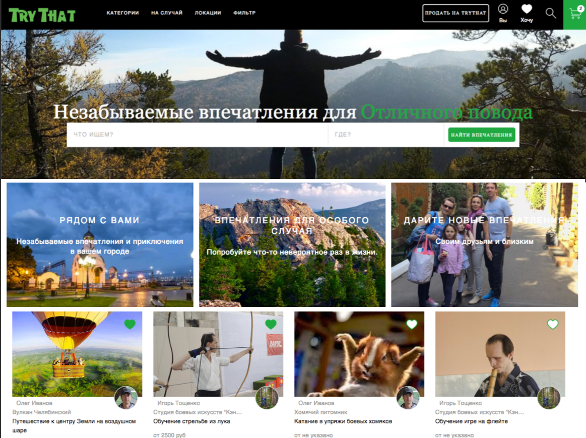

# trythat
Frontend part of @Trythat marketplace based on React/MobX.
This project is a startup platform of unique services. It was implemented in 2018, logically finished and prepared for further marketing. But plans changed.
Try That is a playground for incredible adventures and exciting experiences.

The idea is based on the creation of a platform where people and companies can provide their services
in the field of entertainment, tourism, education, sports and other non-material areas.

From ice skating lessons from champions to individual lessons with the best instructors in the region.

From personal lunches in the best restaurants of the country and master classes from international chefs, to home cooking classes from passionate amateurs.

From visiting private breweries and wineries, to excursions to the most interesting places with connoisseurs of these places.
 

